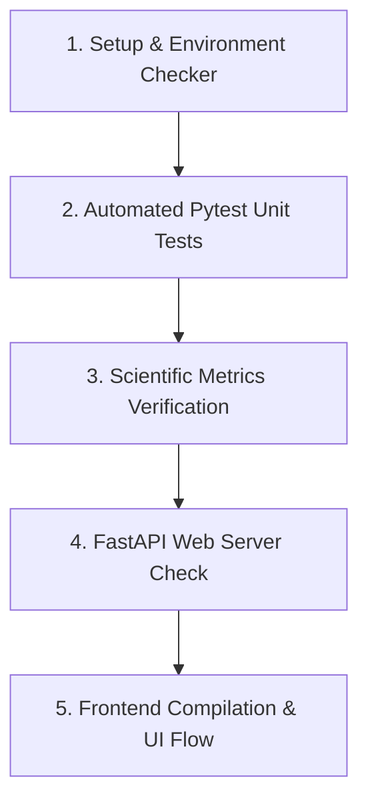

# AlignX Verification Protocol

Follow this step-by-step guide to verify the AlignX project setup, backend operations, scientific quality calculations, and frontend SPA interface.

---

## Verification Pipeline (Recommended Order)

To ensure comprehensive coverage and prevent troubleshooting bottlenecks, always run tests in the following order:



---

### Step 1: Environment & Setup Verification
Before running calculations, verify that external binaries like Mustang and the local Python interpreter environment are correctly configured.

Run the setup diagnostics check:
```powershell
# Run using the local virtual environment Python
.venv\Scripts\python check_setup.py
```
*Expected Output:*
- Checks the Python interpreter and verify if Mustang is detected successfully (either via WSL or native binary).

---

### Step 2: Automated Pytest Unit Tests
Run the comprehensive suite of unit tests, which mock external requests and check the integrity of coordinates downloading, caching, configurations, structures, and API logic.

Run the test suite script:
```powershell
# Executes pytest in the virtual environment
powershell -File run_tests.ps1
```
*Expected Output:*
- Pytest runs 43 items successfully and shows no errors.
- Verification scripts are executed automatically as part of the run.

---

### Step 3: Scientific Metrics & Torsion Verification
Verify the accuracy of scientific calculations, specifically the TM-Score/GDT calculations and Ramachandran torsion angle mapping.

1. **Verify sequence identity:**
   ```powershell
   .venv\Scripts\python tests/verify_identity.py
   ```
2. **Verify RMSD/TM-score metrics on a real run:**
   ```powershell
   .venv\Scripts\python tests/verify_metrics.py
   ```
3. **Verify Ramachandran/Torsion calculation:**
   ```powershell
   .venv\Scripts\python tests/verify_ramachandran.py
   ```

---

### Step 4: FastAPI Web Server Verification
Run the FastAPI web server locally and verify that the backend endpoints are online.

1. **Launch the backend server:**
   ```powershell
   .venv\Scripts\uvicorn src.backend.api:app --host 127.0.0.1 --port 8000
   ```
2. **Test the health endpoint:**
   Open your browser or terminal and hit:
   `http://127.0.0.1:8000/health`
   *Expected Response:*
   ```json
   {
     "status": "healthy",
     "mustang_installed": true,
     "mustang_message": "..."
   }
   ```

---

### Step 5: Frontend Build & UI Flow Verification
Verify the Vite single page application (SPA).

1. **Rebuild the Frontend:**
   Make sure the built HTML assets are packaged for production and copied to the backend's static directory.
   ```powershell
   powershell -File build_frontend.ps1
   ```
2. **Start Development Dev Server (Optional):**
   If you want to run the front-end dynamically with reload capabilities:
   ```powershell
   cd web-frontend
   npm run dev
   ```
   Access the dev server at: `http://localhost:5173`.
3. **Verify Full-Stack Single Port Execution (Recommended):**
   Once built using `build_frontend.ps1`, open `http://127.0.0.1:8000/` in your browser.
   - Verify the sidebar only shows **Active Workspace** and **Session History**.
   - Check the **Active Workspace** tabs (Overview, Ligands, Sequence, Analytics).
   - Enter a PDB ID, add it, choose a chain, and click **Run Structural Alignment** to verify end-to-end calculations.
