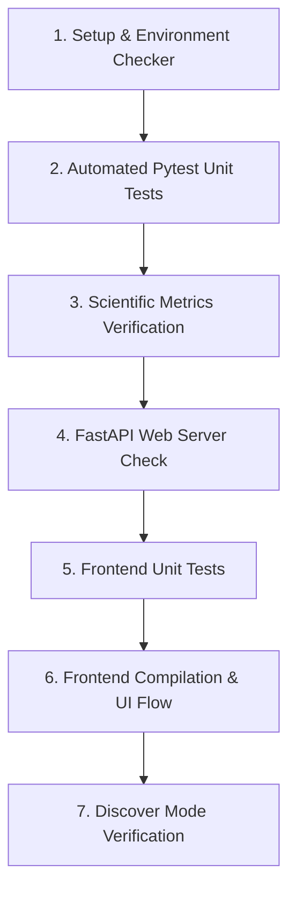

# StructScope Verification Protocol

Follow this step-by-step guide to verify the StructScope project setup, backend operations, scientific quality calculations, and frontend SPA interface.

---

## Verification Pipeline (Recommended Order)

To ensure comprehensive coverage and prevent troubleshooting bottlenecks, always run tests in the following order:



---

### Step 1: Environment & Setup Verification
Before running calculations, verify that external binaries like Mustang and the local Python interpreter environment are correctly configured.

Run the setup diagnostics check:
```powershell
# Run using the local virtual environment Python
.venv\Scripts\python scripts\check_setup.py
```
*Expected Output:*
- Checks the Python interpreter and verify if Mustang is detected successfully (either via WSL or native binary).

---

### Step 2: Automated Pytest Unit Tests
Run the comprehensive suite of unit tests, which mock external requests and check the integrity of coordinates downloading, caching, configurations, structures, and API logic.

Run the test suite script:
```powershell
# Executes pytest in the virtual environment
powershell -File scripts\run_tests.ps1
```
*Expected Output:*
- Pytest runs 172 items successfully and shows no errors.
- Verification scripts are executed automatically as part of the run.

---

### Step 3: Scientific Metrics & Torsion Verification
Verify the accuracy of scientific calculations, specifically the TM-Score/GDT calculations and Ramachandran torsion angle mapping.

1. **Verify sequence identity:**
   ```powershell
   .venv\Scripts\python tests/verify_identity.py
   ```
2. **Verify RMSD/TM-score metrics on a real run:**
   ```powershell
   .venv\Scripts\python tests/verify_metrics.py
   ```
3. **Verify Ramachandran/Torsion calculation:**
   ```powershell
   .venv\Scripts\python tests/verify_ramachandran.py
   ```

---

### Step 4: FastAPI Web Server Verification
Run the FastAPI web server locally and verify that the backend endpoints are online.

1. **Launch the backend server:**
   ```powershell
   .venv\Scripts\uvicorn src.backend.api:app --host 127.0.0.1 --port 8000
   ```
2. **Test the health endpoint:**
   Open your browser or terminal and hit:
   `http://127.0.0.1:8000/health`
   *Expected Response:*
   ```json
   {
     "status": "healthy",
     "mustang_installed": true,
     "mustang_message": "..."
   }
   ```
3. **Test the async alignment job queue:**
   ```bash
   curl -X POST http://127.0.0.1:8000/api/jobs/align -H "Content-Type: application/json" -d "{\"pdb_ids\": [\"4RLT\", \"3UG9\"]}"
   ```
   Expect an immediate `202` with a `job_id`. Poll `GET /api/jobs/{job_id}` until `status` is `completed` (or `failed`).
4. **Test API auth (only if `ALIGNX_API_KEY` is set in your `.env`):**
   A request to any `/api/*` route without `X-API-Key` (or `?api_key=`) should return `401`; with the correct key, `200`.
5. **Test a non-PDB structure source:**
   ```bash
   curl -X POST http://127.0.0.1:8000/api/chains -H "Content-Type: application/json" -d "{\"pdb_ids\": [\"AF-P69905-F1\"]}"
   ```
   Expect a `200` with `source: "alphafold"` in the response. Same pattern works for `SM-{UniProt}` (SWISS-MODEL) and `ESM-{MGYP accession}` (ESM Atlas) IDs.

---

### Step 5: Frontend Unit Tests
Run the Vitest suite covering `api.js` and the JS components (auth headers, job polling, cluster/comparison rendering).

```powershell
cd web-frontend
npm test
```
*Expected Output:* all test files pass (currently 91 tests across the suite, covering `api.js` and every tab/panel component, including `DiscoverTab.js`).

---

### Step 6: Frontend Build & UI Flow Verification
Verify the Vite single page application (SPA).

1. **Rebuild the Frontend:**
   Make sure the built HTML assets are packaged for production and copied to the backend's static directory.
   ```powershell
   powershell -File scripts\build_frontend.ps1
   ```
2. **Start Development Dev Server (Optional):**
   If you want to run the front-end dynamically with reload capabilities:
   ```powershell
   cd web-frontend
   npm run dev
   ```
   Access the dev server at: `http://localhost:5173`.
3. **Verify Full-Stack Single Port Execution (Recommended):**
   Once built using `scripts\build_frontend.ps1`, open `http://127.0.0.1:8000/` in your browser.
   - Check the top bar's tab strip: **Dashboard, Overview, Ligands, Sequence, Analytics, Clusters, Compare, History**.
   - On **Dashboard**, confirm aggregate stats and recent activity populate (may take a few seconds on first load).
   - On **Overview**, add at least two structures — try mixing sources, e.g. a plain PDB ID (`4RLT`) alongside an `AF-`, `SM-`, or `ESM-` prefixed ID — and confirm each shows the correct source badge and metadata line.
   - Choose a chain per structure and click **Run Structural Alignment** — it should show an "Aligning..." state while the background job runs, then populate all tabs once complete.
   - In the 3D viewer, confirm each structure gets a distinct color and the HUD legend/pairwise RMSD list scale to however many structures were aligned (not just a fixed pair).
   - On **Ligands**, switch the structure picker between the aligned structures and confirm the ligand list and interactions refresh for each.
   - On **Sequence**, toggle the report-section checklist and confirm the "Download PDF" link's URL updates; confirm "View Notebook" opens a valid HTML file.
   - Run a second alignment with different structures, then check the **Compare** tab to diff it against the first run.
   - On **History**, confirm past runs list and reloading one restores its full state (3D view, stats, tabs).

---

### Step 7: Discover Mode Verification
Verify the structure-to-function inference pipeline (Foldseek search + InterPro/QuickGO/STRING/Reactome/SIFTS annotation aggregation), separate from the Compare workflow above.

1. **Submit a Discover job:**
   ```bash
   curl -X POST http://127.0.0.1:8000/api/jobs/discover -H "Content-Type: application/json" -d "{\"pdb_id\": \"AF-P69905-F1\"}"
   ```
   Expect an immediate `202` with a `job_id`. Poll `GET /api/jobs/{job_id}` until `status` is `completed` (or `failed`) — this calls the live public Foldseek API (shared rate limit, ~0.1 req/s), so it may take a minute or more.
2. **Verify the three detail levels in the browser:**
   On the **Discover** tab, submit a structure ID and confirm the Public/Student/Researcher toggle changes what's shown for the same underlying result — Researcher should show the unfiltered domain/GO-term lists plus a "High-confidence" stat, while Public/Student show only the confidence-gated ("`annotation.min_confident_probability`-cleared") subset.
3. **Verify the low-confidence path:**
   If a result has zero neighbors clearing the confidence threshold, Public/Student should show an explicit low-confidence message rather than an empty or misleadingly confident result.
4. **Verify export/report parity:**
   From a completed Discover run, confirm both "Download Report" (`GET /api/discover/report`, a self-contained HTML file) and "Download JSON" (`GET /api/discover/export`) links work.
5. **Verify History integration:**
   Confirm the completed Discover run appears on the **Dashboard** and **History** tab with a `DISCOVER` badge (distinct from `COMPARE`-badged Compare runs), and that reopening it from History repopulates the Discover tab (not the Compare workspace).
6. **(Optional) Verify the self-hosted Foldseek backend:**
   Set `foldseek.backend: local` in `config.yaml` with `foldseek.local.binary_path`/`database_dir` pointed at a real Foldseek binary and search database, restart the server, and repeat step 1 — confirm the job completes without calling the public API.
